# Architecture Documentation

This document describes the architectural style, design principles, and folder hierarchy implemented in WeatherNow.

---

## 1. Clean Architecture Breakdown

The project separation guarantees clean division of concerns:
1. **Presentation Layer**: Screen components (`splash_screen.dart`, `loading_screen.dart`, `weather_screen.dart`) that consume providers and render state variations.
2. **Component Layer** (`lib/widgets`): Generic styling visual frames (e.g. `GlassContainer`, `WeatherInfoTile`) that are stateless and layout-agnostic.
3. **Domain & Data Layer** (`lib/models`): Pure data models (`weather_model.dart`) that convert incoming HTTP JSON configurations into type-safe objects.
4. **Service Layer** (`lib/services`): Decoupled interfaces query device resources (`LocationService`, `PermissionService`) and isolate the hardware stack from widgets.

---

## 2. Folder Structure Diagram

```mermaid
graph TD
    lib[lib/] --> app(app.dart)
    lib --> main(main.dart)
    lib --> models[models/]
    lib --> providers[providers/]
    lib --> screens[screens/]
    lib --> services[services/]
    lib --> widgets[widgets/]

    models --> weather_model(weather_model.dart)
    providers --> weather_provider(weather_provider.dart)
    
    screens --> splash_screen(splash_screen.dart)
    screens --> loading_screen(loading_screen.dart)
    screens --> weather_screen(weather_screen.dart)
    
    services --> location_service(location_service.dart)
    services --> permission_service(permission_service.dart)
    
    widgets --> daily_forecast(daily_forecast_list.dart)
    widgets --> glass_container(glass_container.dart)
    widgets --> hourly_card(hourly_forecast_card.dart)
    widgets --> drawer(saved_locations_drawer.dart)
    widgets --> sunrise(sunrise_sunset_visual.dart)
    widgets --> info_tile(weather_info_tile.dart)
```

---

## 3. SOLID Principles Applied

- **Single Responsibility Principle (SRP)**: Each class is dedicated to a singular logical block. `PermissionService` requests permissions, while `WeatherProvider` processes API data payloads.
- **Open/Closed Principle (OCP)**: Layout parameters such as `GlassContainer` can be decorated with multiple custom styles or overlays without modifying its core layout files.
- **Liskov Substitution Principle (LSP)**: Services can be replaced by Mock Services for testing since they use custom standard return structures.
- **Interface Segregation Principle (ISP)**: Custom wrappers isolate the geolocator API and permission handlers, meaning classes only interact with relevant configurations.
- **Dependency Inversion Principle (DIP)**: View states rely on higher-level abstraction models rather than database-specific or platform-specific layouts.
