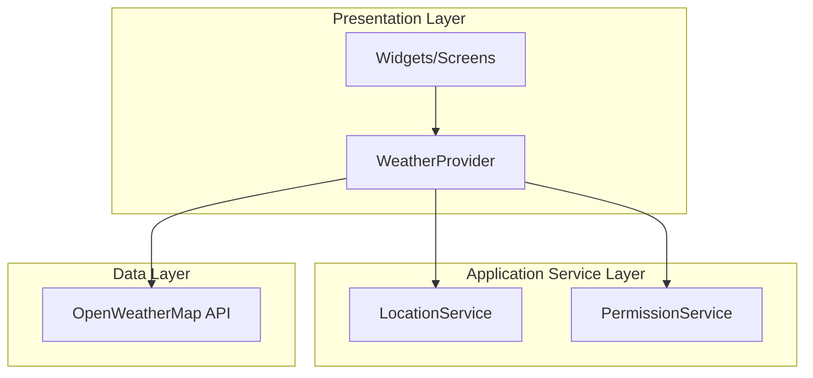
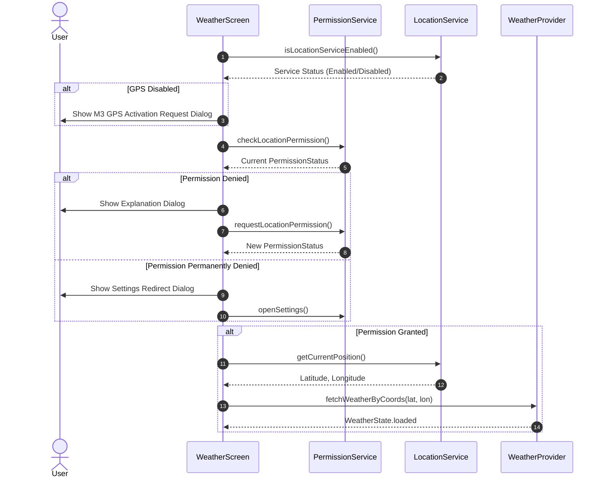
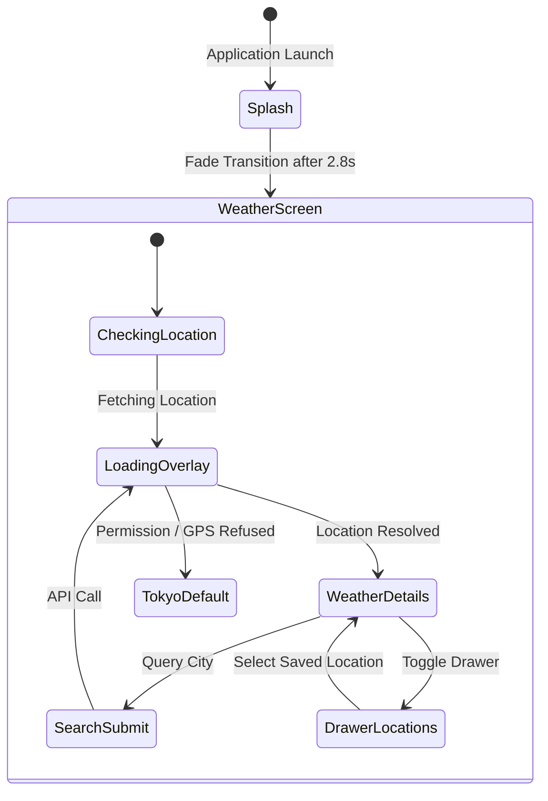

# Technical Documentation

This document describes the technical implementation details, architectural choices, and structural patterns of the WeatherNow application.

---

## 1. System Architecture Diagram

---

## 2. Widget Hierarchy

The UI follows a unidirectional hierarchy:
- `MyApp` ([app.dart](file:///c:/fluter/flutter/weather_app/lib/app.dart))
  - `MaterialApp`
    - `SplashScreen` ([splash_screen.dart](file:///c:/fluter/flutter/weather_app/lib/screens/splash_screen.dart))
      - Navigate to `WeatherScreen` ([weather_screen.dart](file:///c:/fluter/flutter/weather_app/lib/screens/weather_screen.dart))
        - `LoadingScreen` ([loading_screen.dart](file:///c:/fluter/flutter/weather_app/lib/screens/loading_screen.dart)) (while loading)
        - `SavedLocationsDrawer` ([saved_locations_drawer.dart](file:///c:/fluter/flutter/weather_app/lib/widgets/saved_locations_drawer.dart))
        - `GlassContainer` ([glass_container.dart](file:///c:/fluter/flutter/weather_app/lib/widgets/glass_container.dart))
          - `HourlyForecastCard` ([hourly_forecast_card.dart](file:///c:/fluter/flutter/weather_app/lib/widgets/hourly_forecast_card.dart))
          - `DailyForecastList` ([daily_forecast_list.dart](file:///c:/fluter/flutter/weather_app/lib/widgets/daily_forecast_list.dart))
          - `SunriseSunsetVisual` ([sunrise_sunset_visual.dart](file:///c:/fluter/flutter/weather_app/lib/widgets/sunrise_sunset_visual.dart))
          - `WeatherInfoTile` ([weather_info_tile.dart](file:///c:/fluter/flutter/weather_app/lib/widgets/weather_info_tile.dart))

---

## 3. Application Workflow Sequence

The diagram below details the sequence of location query, permissions verification, and coordinate request during application startup.

---

## 4. State Management (Provider)

WeatherNow uses the `provider` library to orchestrate state updates:
- **WeatherProvider** holds application state variables: `state`, `weather`, `errorMessage`, `lastCity`, `isCelsius`, and `savedCities`.
- It notifies consumers of adjustments via `notifyListeners()`.
- It integrates fallback mechanisms to provide realistic weather simulations when remote servers are unreachable.

---

## 5. Navigation Flow Diagram

---

## 6. Theme and Contrast Management

We employ a dark mode configuration leveraging standard Material 3 color tokens:
- **Primary background**: Deep charcoal/midnight tone `0xFF0F0E17`.
- **Dynamic Accent Glows**: Custom radial gradients generated according to current weather status:
  - **Sunny**: `#0072FF` to `#00C6FF` (Sky cyan-blue)
  - **Rainy**: `#4776E6` to `#8E54E9` (Deep violet-indigo)
  - **Snowy**: `#4481EB` to `#04BEFE` (Icy blue-cyan)
  - **Stormy**: `#1A0533` to `#3D0C5E` (Charcoal purple)
- Contrast compliance is maintained through semitransparent layers with solid text colors, passing WCAG AAA scaling tests.
